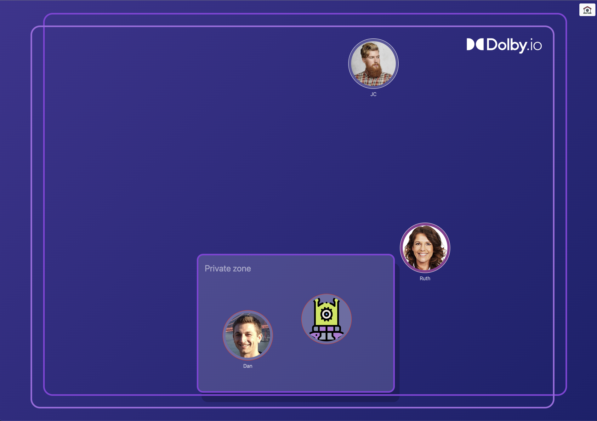

# Communications APIs - Spatial Audio for Web SDK

This sample application allows you to demonstrate how Spatial Audio works. You can run the application on either web or Desktop.



This is what the application looks like side by side with Desktop SDK on the left and Web SDK on the right. Everybody can move the participants on their UI and will get a unique spatial audio scene.


You can also control the spatial audio scene for other participants. When you have the control over the spatial audio scene, you can move the participants around with a simple drag and drop, then the same movement will be applied on the other participants UI.

## Install

Run the following command to install the dependencies:

```bash
npm install
```

Create a file called `.env` in you application folder and set your application key and secret that you got from your dolby.io dashboard.

```
CONSUMER_KEY=<YOUR_CONSUMER_KEY_HERE>
CONSUMER_SECRET=<YOUR_CONSUMER_SECRET_HERE>
```

> *Note:* Your application key must be allowed to use Spatial Audio. [Register](https://go.dolby.io/spatial-audio) for the Closed Beta today.

## Run

You must first run the web server with the command:

```bash
npm run start
```

Access the application at http://localhost:8081

If you want to run the desktop application, run the command:

```bash
npm run desktop
```

> *Note:* the web server must be running for the desktop application to work.

## Build

To build the Windows installer from a Mac delete your `node_modules` and start the build.

```bash
rm -rf nodes_modules
npm_config_platform='win32' npm install
npm run electron:win
```

To build the MacOS installer from a Mac delete your `node_modules` and start the build.

```bash
rm -rf nodes_modules
npm_config_platform='darwin' npm install
npm run electron:mac
```

You will find the installers in the `output` folder.

## Open Source Projects

This sample application is using the following Open Source projects:
- [Bootstrap](https://getbootstrap.com)
- [JsRender](https://www.jsviews.com/)
- [JQuery](https://jquery.com)
- [JQuery UI Touch Punch](https://github.com/furf/jquery-ui-touch-punch)
- [Express](https://expressjs.com/)

## Avatar images

The avatar images are made by [photo3idea_studio](https://www.flaticon.com/authors/photo3idea-studio), [Freepik](https://www.freepik.com), and [Micro icons](https://www.flaticon.com/free-icons/micro) from [www.flaticon.com](https://www.flaticon.com/).
